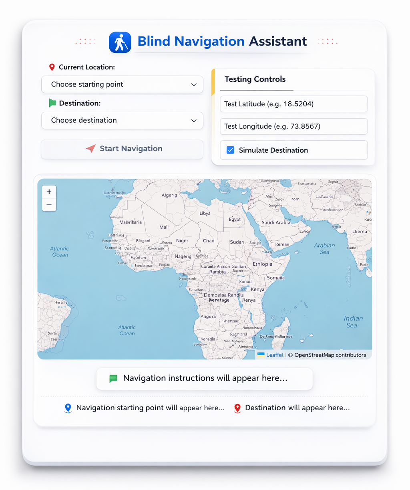

# 🕶️ Intelligent Ultrasonic Glasses for Enhanced Blind Navigation

<p align="center">
  
</p>

<p align="center">
  <a href="https://ieeexplore.ieee.org/document/11323794">
    
  </a>
  
  
  
</p>

---

## 📄 Published Research

This project is published in the **IEEE Conference Proceedings**:

> **"Intelligent Ultrasonic Glasses for Enhanced Blind Navigation"**  
> 📎 [View on IEEE Xplore →](https://ieeexplore.ieee.org/document/11323794)

---

## 📌 Overview

**Intelligent Ultrasonic Glasses** is an assistive technology solution designed to help visually impaired individuals navigate their surroundings safely and independently. The system integrates an **HC-SR04 ultrasonic sensor** mounted on a standard pair of sunglasses to detect obstacles in real time, providing haptic or audio feedback to the user.

This project also features a **web-based Blind Navigation Assistant** that offers GPS-guided turn-by-turn navigation using OpenStreetMap, enabling users to travel between predefined or custom locations with audio instructions.

---

## 🎯 Key Features

- 🔊 **Real-time obstacle detection** using ultrasonic sensing (HC-SR04)
- 📳 **Haptic/audio feedback** to alert users of nearby obstacles
- 🗺️ **Web Navigation Interface** — GPS-based routing with turn-by-turn audio instructions
- 📍 **Leaflet + OpenStreetMap** integration for map rendering
- 🧪 **Testing Controls** — simulate latitude/longitude and destination for easy debugging
- ⚡ **Low power, wearable design** — battery-powered and compact

---

## 🖼️ System Overview

### Hardware Prototype
The ultrasonic sensor module (HC-SR04) is mounted on the nose bridge of the glasses and connected to a microcontroller via color-coded jumper wires.

<p align="center">
  
</p>

### Web Navigation Interface
A browser-based companion app provides visual and audio navigation assistance.

<p align="center">
  
</p>

---

## 🛠️ Hardware Components

| Component | Description |
|-----------|-------------|
| HC-SR04 Ultrasonic Sensor | Obstacle detection (2 cm – 400 cm range) |
| Arduino / Microcontroller | Processing sensor data and triggering feedback |
| 9V Battery | Portable power supply |
| Vibration Motor / Buzzer | Haptic / audio feedback output |
| Sunglasses Frame | Wearable housing for the system |
| Jumper Wires | Signal and power connections |
| Crocodile Clips | Prototyping connections |

---

## 💻 Software Components

### 1. Arduino Firmware (`/firmware`)
Handles ultrasonic sensor reading and threshold-based feedback.

```cpp
#define TRIG_PIN 9
#define ECHO_PIN 10
#define BUZZER_PIN 6
#define THRESHOLD_CM 50  // Alert if obstacle within 50 cm

void setup() {
  pinMode(TRIG_PIN, OUTPUT);
  pinMode(ECHO_PIN, INPUT);
  pinMode(BUZZER_PIN, OUTPUT);
  Serial.begin(9600);
}

void loop() {
  long duration;
  float distance;

  digitalWrite(TRIG_PIN, LOW);
  delayMicroseconds(2);
  digitalWrite(TRIG_PIN, HIGH);
  delayMicroseconds(10);
  digitalWrite(TRIG_PIN, LOW);

  duration = pulseIn(ECHO_PIN, HIGH);
  distance = duration * 0.034 / 2;

  Serial.print("Distance: ");
  Serial.print(distance);
  Serial.println(" cm");

  if (distance > 0 && distance < THRESHOLD_CM) {
    digitalWrite(BUZZER_PIN, HIGH);
  } else {
    digitalWrite(BUZZER_PIN, LOW);
  }

  delay(100);
}
```

### 2. Web Navigation App (`/web`)
- Built with **HTML, CSS, JavaScript**
- Uses **Leaflet.js** + **OpenStreetMap** for mapping
- **OSRM** or equivalent routing API for directions
- Text-to-speech (`SpeechSynthesis API`) for audio instructions

---

## 🗂️ Project Structure

```
Intelligent-Ultrasonic-Glasses-for-Enhanced-Blind-Navigation/
│
├── firmware/
│   └── ultrasonic_glasses.ino       # Arduino sketch
│
├── web/
│   ├── index.html                   # Blind Navigation Assistant UI
│   ├── style.css                    # Styling
│   └── app.js                       # Map, routing, and TTS logic
│
├── Screenshots/
│   ├── glasses_prototype.png        # Hardware photo
│   └── web_ui.png                   # UI screenshot
│
├── docs/
│   └── IEEE_Paper.pdf               # Published paper (if permitted)
│
└── README.md
```

---

## 🚀 Getting Started

### Hardware Setup

1. **Connect HC-SR04** to your Arduino:
   - `VCC` → 5V
   - `GND` → GND
   - `TRIG` → Pin 9
   - `ECHO` → Pin 10
2. **Connect Buzzer/Vibration Motor** → Pin 6
3. **Mount** the sensor on the glasses bridge using double-sided tape or a 3D-printed bracket
4. **Power** via 9V battery connected through a switch

### Arduino Firmware

1. Install [Arduino IDE](https://www.arduino.cc/en/software)
2. Open `firmware/ultrasonic_glasses.ino`
3. Select your board (e.g., Arduino Uno) and port
4. Click **Upload**

### Web Navigation App

1. Clone the repository:
   ```bash
   git clone https://github.com/ShrikarBende/Intelligent-Ultrasonic-Glasses-for-Enhanced-Blind-Navigation.git
   cd Intelligent-Ultrasonic-Glasses-for-Enhanced-Blind-Navigation/web
   ```
2. Open `index.html` in any modern browser (Chrome recommended for TTS support)
3. Allow location permissions when prompted
4. Select a **Starting Point** and **Destination**, then click **Start Navigation**

#### Testing Without GPS
Use the **Testing Controls** panel:
- Enter a **Test Latitude** and **Test Longitude** to simulate your position
- Check **Simulate Destination** to test routing without moving

---

## 🧪 System Workflow

```
User Wears Glasses
       │
       ▼
HC-SR04 Emits Ultrasonic Pulse
       │
       ▼
Arduino Measures Echo Return Time
       │
       ▼
Distance Calculated
       │
  ┌────┴─────┐
  │          │
< 50 cm   ≥ 50 cm
  │          │
Buzzer ON  Buzzer OFF
  │
  ▼
User Alerted → Navigates Safely
```

---

## 🌐 Web App Features

| Feature | Description |
|---------|-------------|
| 📍 Current Location | Auto-detects via browser Geolocation API |
| 🏁 Destination | Select from predefined points or enter coordinates |
| 🗺️ Map View | Interactive Leaflet + OpenStreetMap display |
| 🔊 Audio Instructions | Turn-by-turn via Web Speech API |
| 🧪 Test Mode | Simulate lat/lng and destination for debugging |

---

## 📊 Performance

| Parameter | Value |
|-----------|-------|
| Detection Range | 2 cm – 400 cm |
| Optimal Alert Threshold | ≤ 50 cm |
| Response Time | ~100 ms |
| Power Consumption | ~50 mA (Arduino + sensor) |
| Battery Life | ~8–10 hours (9V, 500 mAh) |

---

## 📖 Citation

If you use this work in your research, please cite:

```bibtex
@inproceedings{bende2024ultrasonic,
  title     = {Intelligent Ultrasonic Glasses for Enhanced Blind Navigation},
  author    = {Bende, Shrikar and others},
  booktitle = {IEEE Conference Proceedings},
  year      = {2024},
  url       = {https://ieeexplore.ieee.org/document/11323794}
}
```


---

## 📃 License

This project is licensed under the **MIT License** — see the [LICENSE](LICENSE) file for details.

---

## 👤 Author

**Shrikar Bende**  
🔗 [GitHub Profile](https://github.com/ShrikarBende)  
💼 [LinkedIn](https://in.linkedin.com/in/shrikar-bende)  
📄 [IEEE Paper](https://ieeexplore.ieee.org/document/11323794)

---

<p align="center">
  Made with ❤️ to empower the visually impaired community
</p>
